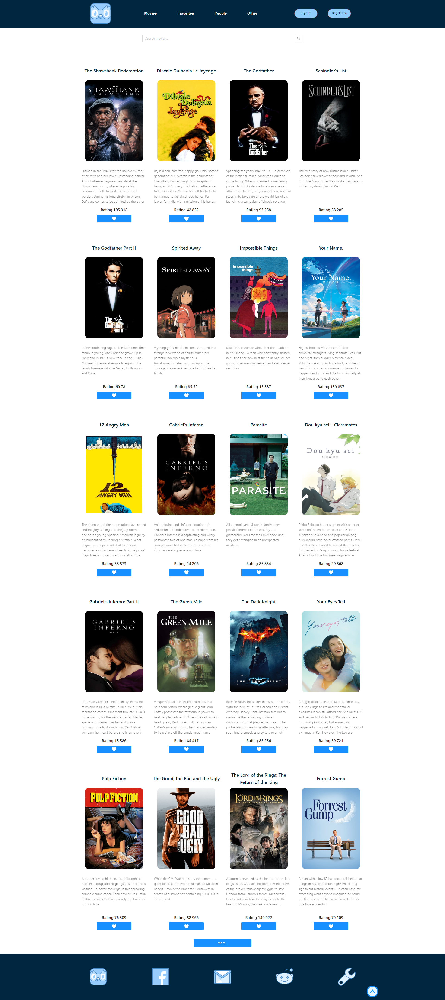
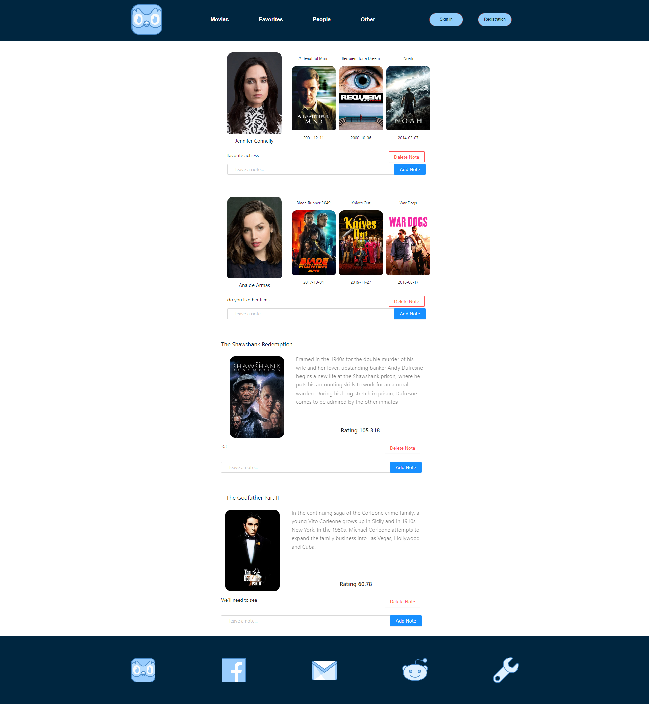
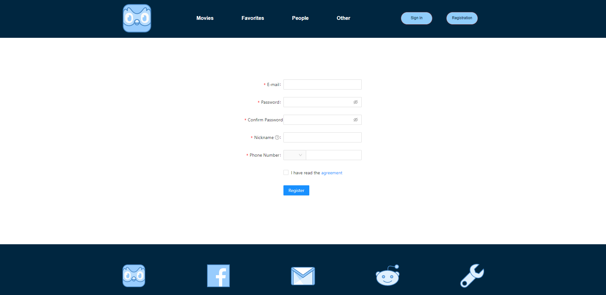

# About the app
Cinema-Magnifier is an application for tracking the most popular movies and actors, according to TMBD statistics. in the application, you can track changes in the rating of certain films or actors, as well as add comments and notes to the ones you like. The data of your choice will be stored on the server, so that after restarting the application you will not have to choose your preferences for it. In addition, you can always remove certain data and notes from your preferences yourself. The application has search functionality configured, as well as pagination of pages, so you can always find your favorite movie or favorite actor not from the top by simply entering a query in the search box.
The application implements a simple registration and authorization system.
The application is optimized for all desktop and mobile device screens (adaptive layout)

This project was bootstrapped with [Create React App](https://github.com/facebook/create-react-app).

## Technology stack:
- typeScript 
- React
- Redux Toolkit
- Axios
- Express
- Redux Saga
- Styled-components 
- Ant-design

In the project directory, you can run:

### `npm install`
### `run start`

In the server directory, you can run:

### `npm install`
### `run dev`

Runs the app in the development mode.\
Open [http://localhost:3000](http://localhost:3000) to view it in the browser.

The page will reload if you make edits.\

## Learn More

the application is installed on github pages. 
### `https://ar1xe.github.io/cinema-magnifier/`
